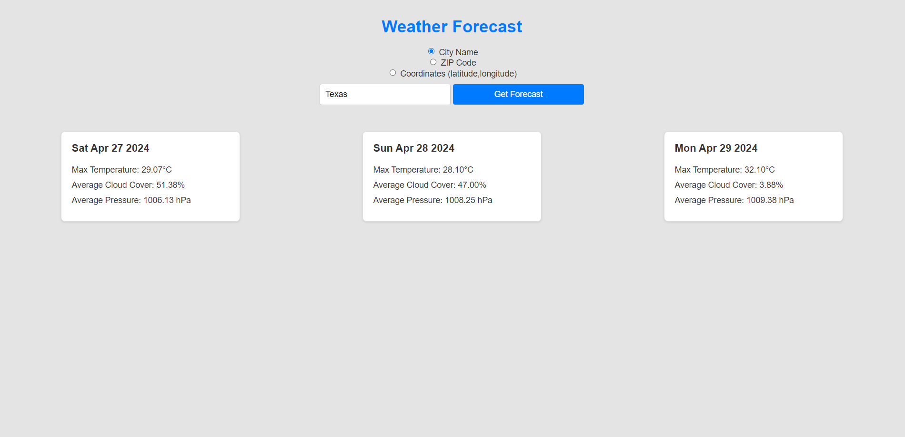

# Weather Forecast App
### Description
The Weather Forecast App is a simple, user-friendly web application that allows users to obtain weather forecasts based on their chosen location. Users can search for weather information using city names, ZIP codes, or geographical coordinates (latitude and longitude). This project utilizes the OpenWeatherMap API to fetch forecast data and display it on the web page.

  

### Features
Search for weather forecasts by city name, ZIP code, or coordinates.
Displays weather forecasts including maximum temperature, average cloud cover, and average atmospheric pressure for the next three days.
Input validation for city names, ZIP codes, and coordinates.
Responsive design for optimal viewing on various devices.

### Prerequisites
Before you begin, ensure you have met the following requirements,

   * You have a modern web browser installed (Chrome, Firefox, Safari, or Edge).
   * You have a basic understanding of HTML, CSS, and JavaScript.
   * You have an API key from OpenWeatherMap. You can obtain one by signing up at OpenWeatherMap.

### Getting Started
1. Obtain an API Key
2. Sign up for an OpenWeatherMap API key if you haven't already.
3. Insert your API key into the script.js file, replacing the apiKey variable's placeholder value.

### Running the App
To run the Weather Forecast App, simply open the index.html file in your web browser. For a better development experience with live reloading, consider using the Live Server extension in Visual Studio Code.

1. Open with Live Server (VS Code Extension):

    * Right-click on index.html in VS Code.
    * Select "Open with Live Server".
